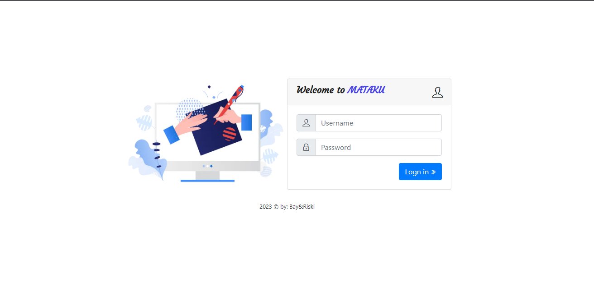
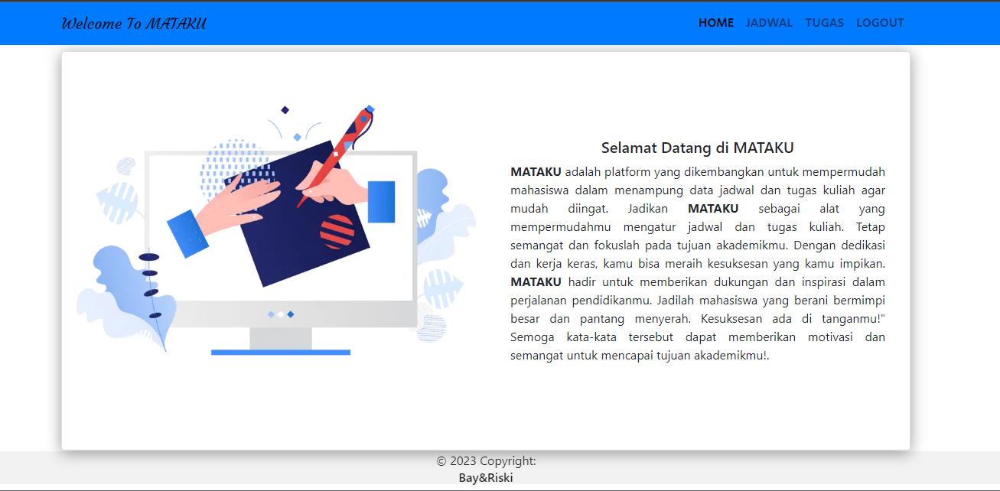
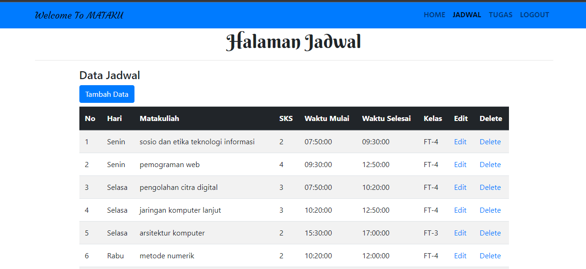

# Aplikasi-MATAKU-CRUD-MYSQLi
<b>MATAKU</b> adalah platform yang dikembangkan untuk 
      mempermudah mahasiswa dalam menampung data jadwal dan tugas kuliah agar 
      mudah diingat. Jadikan <b>MATAKU</b> sebagai tempat semangat dan fokuslah pada tujuan akademikmu. Dengan dedikasi dan kerja keras, kamu bisa meraih
      kesuksesan yang kamu impikan. <b>MATAKU</b> hadir untuk memberikan dukungan dan inspirasi dalam perjalanan pendidikanmu. Jadilah mahasiswa yang berani bermimpi besar dan pantang menyerah. Kesuksesan ada di tanganmu!"
        
Bahasa Pemrograman 	: PHP,
Database		        : MySQL (Ekstensi MySQLi),
Metode Pemrograman	: Prosedural,
Template		        : Bootstrap 4

# Fitur
1. Create
2. Read
3. Update
4. Delete
5. Search
6. Penggunaan CSS Bootstrap 4

##  Demo Aplikasi  [Aplikasi MATAKU](https://webku.one/app/street-food-sederhana/)

##  Tampilan Login

##  Tampilan Home

##  Tampilan Jakwal

##  Developer Team
## Asmat Baidawi `2021520021` Moh Riski `2021520021`

